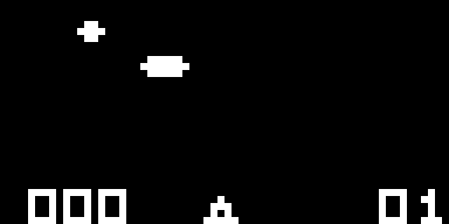

# PureScript Chip8 Emulator

This is something I wrote for fun. Not all games work as I haven't implemented all opcodes. UFO, Blitz & Space Invaders are some of the games that do work.

[More ROMS](https://github.com/alexanderdickson/Chip-8-Emulator/tree/master/roms).

# TODOs

- [ ] Implement all Opcodes
- [ ] Implement Audio
- [ ] Figure a way to stop emulation when the program exits
- [ ] Add a drop-down UI for changing loading a new game

